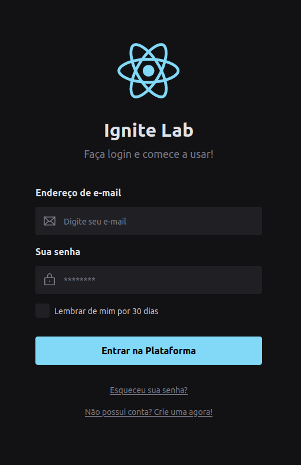
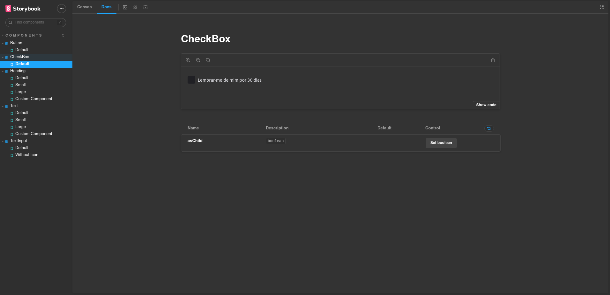

<h1 align="center"> Designer System - Ignite Lab </h1>

  <a href="#-tecnologias">Tecnologias</a>&nbsp;&nbsp;&nbsp;|&nbsp;&nbsp;&nbsp;
  <a href="#-projeto">Projeto</a>&nbsp;&nbsp;&nbsp;|&nbsp;&nbsp;&nbsp;
  <a href="#memo-licença">Licença</a>

  

 

  

  

## 🚀 Tecnologias

Este projeto foi desenvolvido com as seguintes tecnologias:

- React e TypeScript
- [Vite](https://vitejs.dev/)
- [Node e NPM](https://nodejs.org/)
- [Storybook](https://storybook.js.org/)
- [Tailwindcss](https://tailwindcss.com/)
- [Figma](https://www.figma.com/)
- [Radix-Ui](https://www.radix-ui.com/)

## 💻 Projeto

Neste projeto eu pude aprender muito sobre design system, CI/CD, acessibilidade e como utilizar componentes do react e documentar com o Storybook. Pude aprender a como criar componentes no Figma e como padronizar atráves desta ferramenta.

## :memo: Licença

Esse projeto está sob a licença MIT.
